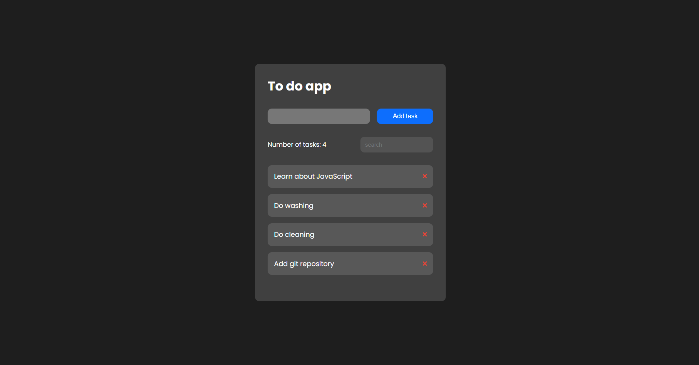

# Todo App

> Live demo [https://jakubparlej.github.io/todoapp/](https://jakubparlej.github.io/todoapp/).

## Table of Contents

- [General info](#general-info)
- [Technologies](#technologies)

## General info

This is todo app which I've created while learning Javascript.

## Technologies

Project is created with:

- HTML
- CSS
- Javascript

## Contact

Created by [@jakubparlej](https://jprojects.pl) - feel free to contact me!

